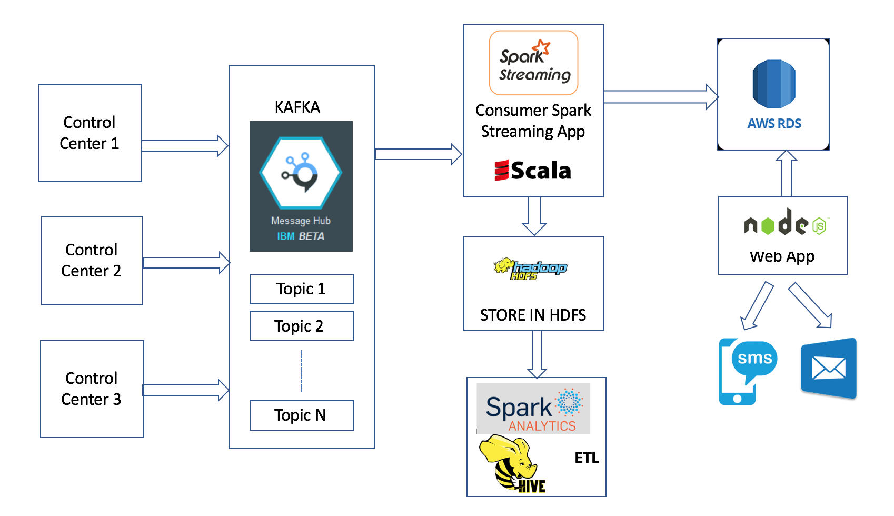

# Crime Alert and Analytics System

# Description

Application to provide realtime alerts for crime for all registered users using email or SMS. 
Provide analytics on historical and realtime ingested data of all crimes comparing with other socio-economic factors.

# Architecture

# what do we do?

1) Stream Crime Data from Control Centers to KAFKA (IBM BLUEMIX MESSAGE HUB)
2) Use Apace Spark to stream Data from KAFKA and store in HDFS
3) Perform Analytics using Spark
4) Provide Email and SMS alerts for violent crimes

# How do we do?

1) Stream Crime Data to KAFKA (IBM BLUEMIX MESSAGE HUB)  from Control Centers.
2) Read Stream's of Data in real-time from Kafka using Apache Spark Streaming (using scala as programming language).
3) Store data to Hadoop Distributed File System (HDFS) for ETL processing and perform analytics.
4) Filter violent crimes and store in Amazon RDS for NodeJS web app to send alerts to all registered users in interested area.
5) Web application reads from RDS and sends out alerts to users in realtime. 

# Modules

Kafka/Producer - To stream data into Kafka topics.

NodeJS_Application  - Web application to send alerts and register user's.
  Website URL: http://ec2-34-216-77-34.us-west-2.compute.amazonaws.com:3019/

SparkStreaming - Spark/Scala application for realtime streaming and performing analytics.

